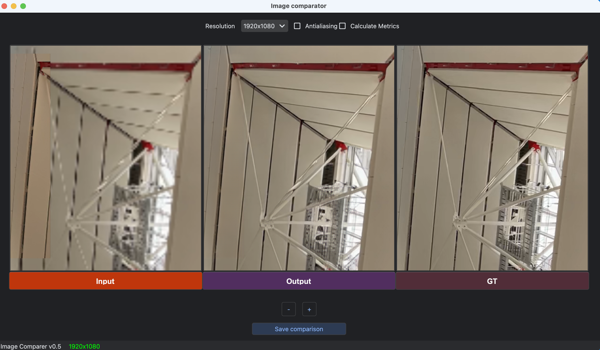

# Image Comparator

An advanced image comparison tool with metric calculation capabilities. This application enables you to compare multiple images side by side with synchronized scrolling, zooming, and optional quantitative analysis using PSNR, SSIM, and LPIPS metrics.



## Features

- **Multi-Image Comparison:** View and compare multiple images simultaneously with customizable layouts
- **Flexible Panel Layouts:** Dynamic grid arrangements (1×N, 2×2, 2×3, 3×2, etc.) for any number of images
- **Curtain Comparison Mode:** Interactive before/after slider comparison for exactly 2 images
- **Synchronized Navigation:** Scroll and zoom across all images simultaneously for precise comparison
- **Configurable Interface:** Customize image names, background colors, and text colors
- **Metric Calculation:** Optional PSNR, SSIM, and LPIPS metric calculation against ground truth
- **Easy Configuration:** Simple dictionary-based setup for default images and settings

## Getting Started

### Prerequisites

Make sure you have the following prerequisites installed:

- Python 3.7+
- Required packages (see installation section)

### Installation

1. Clone or download this repository:

   ```shell
   git clone https://code.byted.org/qilin.deng/ImageComparator.git
   cd image_comparator
   ```

2. Install the required dependencies:

   ```shell
   pip install -r requirements.txt
   ```

   Or install packages individually:
   ```shell
   pip install PySide6 pyqtdarktheme Pillow scikit-image torch lpips
   ```

### Configuration

Edit the `main.py` file to configure your default images. The configuration uses a simple dictionary format:

```python
default_items = {
    "Input": {
        "path": "/path/to/your/input/image.png",
        "color": "#6E2C00",  # Optional: roasted sienna (recommended)
    },
    "Output": {
        "path": "/path/to/your/output/image.png", 
        "color": "#004D40",  # Optional: forest cyan (recommended)
    },
    "GT": {
        "path": "/path/to/your/ground_truth/image.png",
        "color": "#512E5F",  # Optional: plum (recommended)
    },
    "Method 4": {
        "path": "/path/to/another/image.png",
        # No color specified - will use random expert-curated color
    },
}
text_color = "#f9f9f9"  # Text color for all labels
```

**Note:** 
- The `color` field is optional. If not specified, the application will automatically select from a professionally curated color palette.
- **You can drag and drop images based on the UI.**

### Running the Application

```shell
python main.py
```

## Usage

### Basic Navigation
- **Mouse Wheel:** Zoom in/out on images
- **Click and Drag:** Pan around images
- **Synchronized Movement:** All image views move together for easy comparison

### Controls
- **Resolution Dropdown:** Change the display resolution of images
- **Layout Dropdown:** Switch between available grid arrangements (1×N, 2×2, etc.)
- **Folder Compare Mode Checkbox:** Enable folder-to-folder comparison mode
- **Curtain Mode Checkbox:** Enable interactive before/after comparison (only available with exactly 2 images)
- **Show Differences Checkbox:** Enable visual difference highlighting (only available with exactly 2 images in grid mode)
- **Antialiasing Checkbox:** Toggle smooth image rendering (unchecked by default for better performance)
- **Calculate Metrics Checkbox:** Enable/disable metric calculations (unchecked by default for faster loading)

### Folder Comparison Mode

Compare entire folders of images side-by-side, perfect for evaluating different processing algorithms or image sources:

#### How to Use Folder Comparison:
1. **Enable Folder Mode:** Check the "Folder Compare Mode" checkbox
2. **Select Left Folder:** Click "Select Left Folder" and choose your first image folder
3. **Select Right Folder:** Click "Select Right Folder" and choose your second image folder
4. **Navigate:** Use the Previous/Next buttons or keyboard shortcuts to browse through image pairs

#### Features:
- **Smart Image Matching:** Automatically matches images by filename or index
- **Synchronized Navigation:** Browse through corresponding image pairs with Previous/Next buttons
- **Keyboard Shortcuts:** 
  - **Arrow Keys/A/D:** Navigate between image pairs
  - **Home:** Jump to first image pair
  - **End:** Jump to last image pair
- **Progress Counter:** Shows current position (e.g., "5 / 23")
- **Compatible with Curtain Mode:** Switch to curtain mode for detailed comparison of current pair
- **Compatible with Difference Mode:** Enable visual differences for current image pair

#### Supported Image Formats:
- JPG/JPEG, PNG, BMP, TIFF/TIF, GIF (both uppercase and lowercase extensions)

#### Use Cases:
- **Algorithm Comparison:** Compare results from different image processing methods
- **Quality Assessment:** Evaluate different compression settings or sources
- **Dataset Analysis:** Compare original vs processed datasets
- **A/B Testing:** Systematically compare two sets of generated images
- **Manga/Comic Comparison:** Compare image quality from different sources (as mentioned in your use case)

### Curtain Comparison Mode

When you have exactly **2 images** loaded, you can enable **Curtain Mode** for an interactive before/after comparison:

#### How to Use Curtain Mode:
1. **Load exactly 2 images** (through default configuration or drag & drop)
2. **Click the "Curtain Mode" checkbox** - it becomes available when you have 2 images
3. **Drag the circular slider** to reveal more of the "before" or "after" image
4. **View labels** showing which image is which (positioned dynamically)

#### Features:
- **Interactive Slider:** Drag the white circular handle to adjust the comparison split
- **Zoom & Pan Support:** Full zoom in/out and panning functionality just like grid mode
- **Smart Mouse Interaction:** Click on slider handle to drag curtain, click elsewhere to pan image
- **Smooth Comparison:** See exactly how areas change between the two images
- **Dynamic Labels:** "Before" and "After" labels appear when there's enough space
- **Professional Design:** Clean white slider with directional arrows
- **Auto-scaling:** Images are automatically scaled to fit while maintaining aspect ratio

#### Navigation in Curtain Mode:
- **Mouse Wheel:** Zoom in/out on images (zooms toward mouse cursor)
- **Left Click + Drag on Handle:** Adjust the curtain slider position
- **Left Click + Drag on Image:** Pan around zoomed images
- **Right Click:** Reset zoom and pan to default view
- **Keyboard Shortcuts:**
  - `R` or `Ctrl+0`: Reset view to default zoom/pan
  - `+` or `=`: Zoom in
  - `-`: Zoom out

#### Use Cases:
- **Before/After Processing:** Compare original vs processed images
- **Method Comparison:** Compare results from two different algorithms
- **Quality Assessment:** Evaluate image enhancement or restoration results
- **Research Analysis:** Side-by-side comparison for academic presentations
- **Pixel-Level Analysis:** Use difference mode to identify exact pixel changes
- **Algorithm Validation:** Verify image processing algorithm correctness

### Visual Difference Mode

When in **Curtain Mode** with exactly 2 images, you can enable **"Show Differences"** to see a pixel-level difference visualization:

#### How Difference Detection Works:
- **Perceptual Color Analysis:** Uses YIQ color space for human-perceived differences
- **Anti-Aliasing Detection:** Intelligently identifies and highlights anti-aliased edges
- **Configurable Sensitivity:** Adjustable threshold for difference detection
- **Color-Coded Results:** Red for significant differences, yellow for anti-aliased pixels

#### Difference Visualization:
- **Red Areas:** Significant pixel differences between images
- **Yellow Areas:** Anti-aliased pixels and edge differences  
- **Faded Background:** Unchanged areas shown with reduced opacity
- **Pixel-Perfect Analysis:** Zoom in to see exact pixel-level differences

#### Based on Research:
- Simple image subtraction with hot colormap visualization
- **Hot Colormap:** Black (no difference) → Red → Yellow → White (maximum difference)
- **Fast Processing:** Basic pixel-wise subtraction for reliable performance
- **Threshold-based:** Configurable noise reduction threshold


#### Sample Terminal Output:
When you check the "Calculate Metrics" box, you'll see output like this in your terminal:

```
Starting metrics calculation in background...

--- Metrics Calculation ---
Ground Truth: GT
========================================
Metrics for Input:
  PSNR: 22.11 dB
  SSIM: 0.6433
  LPIPS: 0.3732
------------------------------
Metrics for Output:
  PSNR: 23.54 dB
  SSIM: 0.7222
  LPIPS: 0.1128
------------------------------
Metrics calculation completed!
```

#### Supported Metrics:
- **PSNR (Peak Signal-to-Noise Ratio):** Measures image quality in decibels (dB)
- **SSIM (Structural Similarity Index):** Measures structural similarity (0-1, higher is better)
- **LPIPS (Learned Perceptual Image Patch Similarity):** Perceptual similarity using deep learning (lower is better)

### Loading New Images
- **Drag and Drop:** Drop image files directly onto any view
- **Multiple Files:** Drop multiple files to load them into separate views
- **Panel Integration:** Dropped images automatically integrate with the current layout system

## Customization

### Colors
You can use any valid CSS color format:
- Hex with transparency: `"#2c3e50cc"`
- Hex without transparency: `"#2c3e50"`
- Color names: `"red"`, `"blue"`, etc.
- If no color is specified, a professional color will be automatically selected

### Adding More Images
Simply add more entries to the `default_items` dictionary:

```python
default_items = {
    "Input": {"path": "/path/to/input.png", "color": "#6E2C00"},
    "Method A": {"path": "/path/to/methodA.png", "color": "#004D40"},
    "Method B": {"path": "/path/to/methodB.png"},  # Auto color selection
    "Method C": {"path": "/path/to/methodC.png", "color": "#512E5F"},
    "Ground Truth": {"path": "/path/to/gt.png", "color": "#BF360C"},
}
```

## File Structure

```
image_comparator/
├── main.py              # Main application entry point and configuration
├── app_gui.py           # Main GUI layout and logic
├── graphics_view.py     # Individual image view components
├── image_view.py        # Image display and interaction handling
├── metrics.py           # PSNR, SSIM, and LPIPS calculation
├── requirements.txt     # Python dependencies
├── README.md           # This file
└── screenshot.png      # Application screenshot
```


## Tips

1. **Performance:** Disable "Calculate Metrics" when you don't need quantitative analysis for faster loading
2. **Large Images:** The application supports high-resolution images with smooth zooming and panning
3. **Batch Comparison:** Use the configuration dictionary to quickly switch between different image sets
4. **Ground Truth:** Always place your ground truth/reference image last in the configuration for proper metric calculation
5. **Progress Monitoring:** Watch the terminal to see metrics being calculated progressively for each image

## Troubleshooting

### LPIPS Model Download
The first time you use LPIPS metrics, the model will be downloaded automatically. This may take a few minutes but only happens once.

## License

This project is open source. Please refer to the license file for more information.

